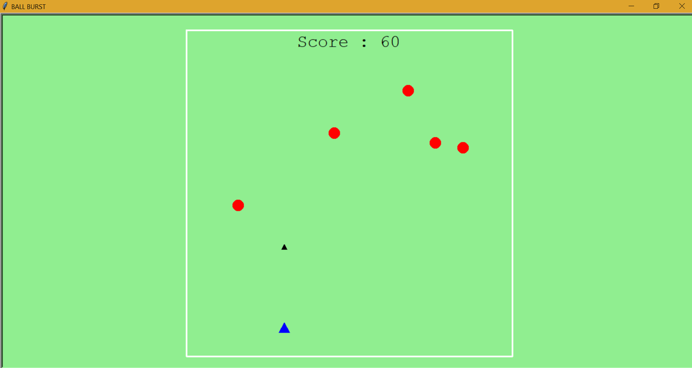
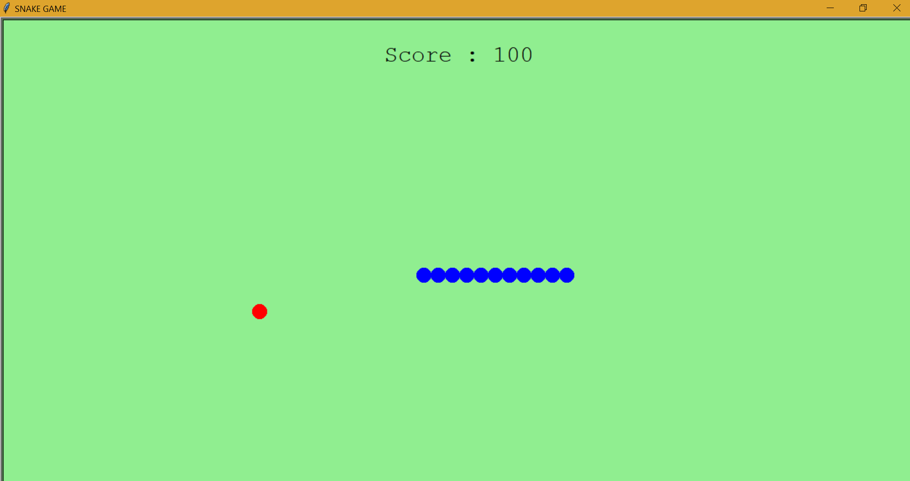

#                               BALL BURST

Ball Burst is a game made using Turtle Programming in Python.

# Steps to Run: -

1 -> Download the above contents.

2 -> Run the Ball Burst.py file.

# Rules: -

1 -> You can use the left/right arrow keys to move the pointer.

2 -> Spacebar to Shoot.

3 -> You have to prevent the Balls from hitting the pointer.

4 -> Each time you burst the ball new balls will be added and scores                      
       will be updated.
       
 #                               SNAKE GAME
 
Snake game is also built using Turtle Programming in python.

# Steps to Run: -

1 -> Download the above contents.

2 -> Run the SNAKE GAME.py file.

# Rules: -

1 -> You can use the w/a/s/d keys to move the snake.

2 -> Prevent the snake from touching back its own body.

3 -> You have to make the snake eat its food, each time food is eaten
         your score will be updated. 
         

